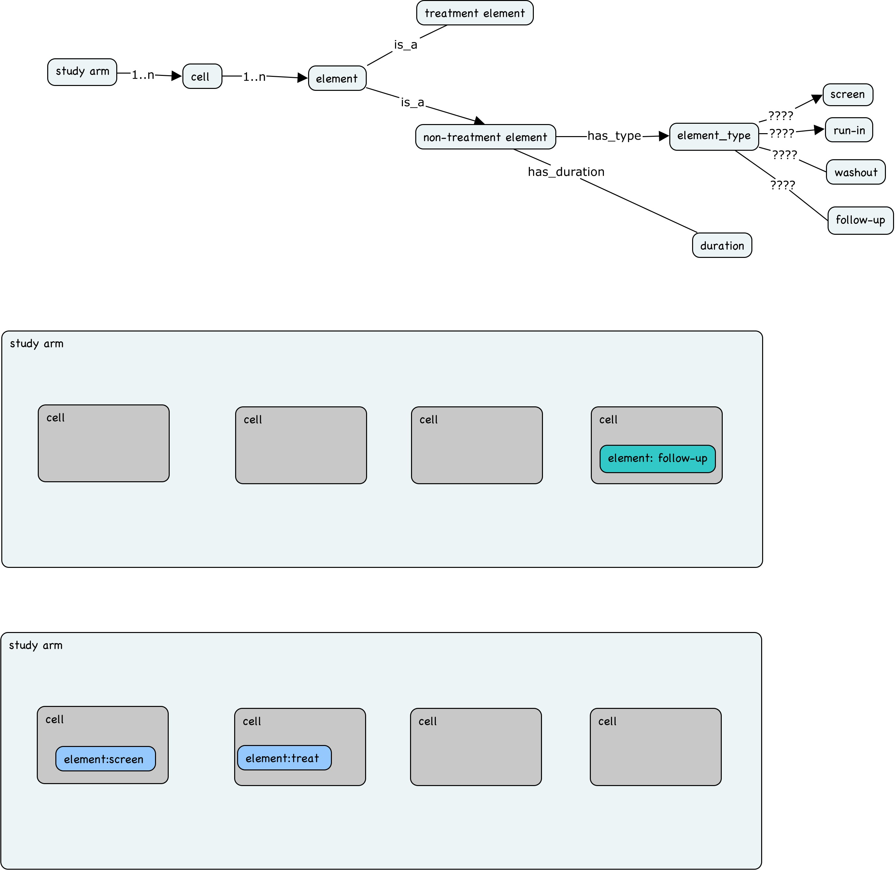

#################################################
Creating ISA content with a Sample and Assay plan
#################################################

The ISA API provides a set of classes that you can use to plan a study, in terms of sample collection and assay run patterns.
Objects of these classes can then be used to dump ISA-Tab or ISA-JSON templates corresponding to your study design.
They are found in the ``isatools.create.models`` module.

Take a look at the `isatools-notebooks <https://github.com/ISA-tools/isatools-notebooks>`_ GitHub repository for Jupyter Notebook examples of using the planning objects.

If you have any question about the ISA-API, get in touch with us via our `mailing list <isatools@googlegroups.com>`_ .

Report feature requests, enhancement requests or bugs via our `issue tracker <https://github.com/ISA-tools/isa-api/issues>`_ .

We'll start as usual, by building an ``Investigation`` object, an ``Study`` object, and in this example. We'll also create ``Source`` and ``Sample`` materials associated with that ``Study`` object.

.. code-block:: python

    >>> from isatools.model import *
    >>> import json
    >>> from isatools.isajson import ISAJSONEncoder
    >>> from isatools.create.models import *

    >>> investigation = Investigation()
    >>> investigation1 = Investigation() # to be used with the study create function

    >>> study = Study(filename="s_study_xover.txt")
    >>> study.identifier = identifier.value
    >>> study.title = title.value
    >>> study.description = description.value
    >>> study.submission_date = str(sub_date.value)
    >>> study.public_release_date = str(release_date.value)
    >>> study.sources = [Source(name="source1")]
    >>> study.samples = [Sample(name="sample1")]
    >>> study.protocols = [Protocol(name="sample collection")]
    >>> study.process_sequence = [Process(executes_protocol=study.protocols[-1], inputs=[study.sources[-1]], outputs=[study.samples[-1]])]
    >>> investigation.studies = [study]

In the following sections, we will start exploring how to use the new ``isatools.create.models`` objects. These objects are to a large extend aligned with `CDISC <http://cdisc.org/>`_  and its `Study Design Model<https://www.cdisc.org/standards/data-exchange/sdm-xml>`_ in order to ensure easy integration and possibly interoperation with this clinical model.
The key addition to the ISA model means that it is now possible to explicitly design and support ``longitudinal studies``, whereby study subjects are followed over a period of time, are assayed repeatedly and may also be treated with various interventions, one after the other.
Treatments can also be defined as concomittant intervention, which is often the case in clinical context when deploying multidrug therapies.
Therefore, in keeping with CDISC like representation, the ISA create model relies on objects such as ``Study Arm``, ``Study Cell``, ``Study Element`` which can be either of type ``Treatment`` or not.
This component of the API allows users to define 3 plans:

- a ``Treatment plan``, which defines the nature of the various interventions or treatment that will be applied to the study subject.
- a ``sample collection plan``, which defines the nature of the specimens collected from study subjects over the course of the study, during specific sessions (known as ``VISITS`` in CDISC speak).
- a data collection plan also known as the ``assay plan``, which will define the type of assays used for phenotyping subjects and samples.

    Figure 1 provides an overview of the ISA Study Design Elements.

1. Creation of the first ISA Study Design Element, of type ``Non-Treatment``
----------------------------------------------------------------------------

.. code-block:: python

    >>> nte1 = NonTreatment(element_type='screen')
    >>> print(nte1)

which should return the following:

.. code-block:: json

    >>> NonTreatment(type='screen', duration=isatools.model.FactorValue(factor_name=isatools.model.StudyFactor(name='DURATION',factor_type=isatools.model.OntologyAnnotation(term='time', term_source=None, term_accession='', comments=[]), comments=[]), value=0.0, unit=None))

.. note:: IMPORTANT: ISA ``Element`` **must** be assigned a type, which can one of {"screen", "run-in", "washout", "treatment", "follow-up"}.

2. Creation of another ISA Study Design Element, of type ``Treatment``
----------------------------------------------------------------------

.. code-block:: python

    >>> te1 = Treatment()
    >>> te1.type='radiological intervention'
    >>> print(te1)

which should return the following:

.. code-block:: python

    >>> Treatment
        (type=radiological intervention,
        factor_values=[])

2.1 defining the first treatment as a vector of ISA factor values:

Under ``ISA Study Design Create mode``, a ``Study Design Element`` of type ``Treatment`` needs to be defined by a
vector of ``Factors`` and their respective associated ``Factor Values``. This is done as follows:

.. code-block:: python

    >>> f1 = StudyFactor(name='light', factor_type=OntologyAnnotation(term="electromagnetic energy"))
    >>> f1v = FactorValue(factor_name=f1, value="visible light at 3000K produced by LED array")
    >>> f2 = StudyFactor(name='dose', factor_type=OntologyAnnotation(term="quantity"))
    >>> f2v = FactorValue(factor_name=f2, value='250', unit=OntologyAnnotation(term='lux'))
    >>> f3 = StudyFactor(name='duration', factor_type=OntologyAnnotation(term="time"))
    >>> f3v = FactorValue(factor_name=f3, value='1', unit=OntologyAnnotation(term='hr'))
    >>> print(f1v,f2v)

which should return the following:

.. code-block:: python

    >>> FactorValue(
    factor_name=light
    value='visible light at 3000K produced by LED array'
    unit=
    )
    FactorValue(
    factor_name=dose
    value='250'
    unit=lux    )

#assigning the factor values declared above to the ISA treatment element
.. code-block:: python

    >>> te1.factor_values = [f1v,f2v,f3v]
    >>> print(te1)

which should return the following:

.. code-block:: python

    >>> Treatment
        (type=radiological intervention,
        factor_values=[isatools.model.FactorValue(factor_name=isatools.model.StudyFactor(name='dose', factor_type=isatools.model.OntologyAnnotation(term='quantity', term_source=None, term_accession='', comments=[]), comments=[]), value='250', unit=isatools.model.OntologyAnnotation(term='lux', term_source=None, term_accession='', comments=[])), isatools.model.FactorValue(factor_name=isatools.model.StudyFactor(name='duration', factor_type=isatools.model.OntologyAnnotation(term='time', term_source=None, term_accession='', comments=[]), comments=[]), value='1', unit=isatools.model.OntologyAnnotation(term='hr', term_source=None, term_accession='', comments=[])), isatools.model.FactorValue(factor_name=isatools.model.StudyFactor(name='light', factor_type=isatools.model.OntologyAnnotation(term='electromagnetic energy', term_source=None, term_accession='', comments=[]), comments=[]), value='visible light at 3000K produced by LED array', unit=None)])

3. Creation of a second  ISA Study Design Element, of type Treatment, following the same pattern.
-------------------------------------------------------------------------------------------------

.. code-block:: python

    >>> te3 = Treatment()
    >>> te3.type = 'radiological intervention'
    >>> rays = StudyFactor(name='light', factor_type=OntologyAnnotation(term="electromagnetic energy"))

    >>> raysv = FactorValue(factor_name=rays, value='visible light at 3000K produced by LED array')
    >>> rays_intensity = StudyFactor(name='dose', factor_type=OntologyAnnotation(term="quantity"))
    >>> rays_intensityv= FactorValue(factor_name=rays_intensity, value = '250', unit=OntologyAnnotation(term='lux'))
    >>> rays_duration =  StudyFactor(name = 'duration', factor_type=OntologyAnnotation(term="time"))
    >>> rays_durationv = FactorValue(factor_name=rays_duration, value='1', unit=OntologyAnnotation(term='hour'))

    >>> te3.factor_values = [raysv,rays_intensityv,rays_durationv]
    >>> print(te3)

which should return the following:

.. code-block:: python

    >>> "Treatment
        (type=radiological intervention,
        factor_values=[isatools.model.FactorValue(factor_name=isatools.model.StudyFactor(name='dose', factor_type=isatools.model.OntologyAnnotation(term='quantity', term_source=None, term_accession='', comments=[]), comments=[]), value='250', unit=isatools.model.OntologyAnnotation(term='lux', term_source=None, term_accession='', comments=[])), isatools.model.FactorValue(factor_name=isatools.model.StudyFactor(name='duration', factor_type=isatools.model.OntologyAnnotation(term='time', term_source=None, term_accession='', comments=[]), comments=[]), value='1', unit=isatools.model.OntologyAnnotation(term='hour', term_source=None, term_accession='', comments=[])), isatools.model.FactorValue(factor_name=isatools.model.StudyFactor(name='light', factor_type=isatools.model.OntologyAnnotation(term='electromagnetic energy', term_source=None, term_accession='', comments=[]), comments=[]), value='visible light at 3000K produced by LED array', unit=None)])

4. Creation of 'wash out' period as an ISA Study Design Element.
----------------------------------------------------------------

.. code-block:: python

    >>># Creation of another ISA element, which is not a Treatment element, which is of type `screen` by default
    >>> nte2 = NonTreatment()
    >>> nte2.type = 'washout'
    >>> print(nte2.type)
    >>># setting the factor values associated with 'default' DURATION Factor associated with such elements
    >>> nte2.duration.value="2"
    >>> nte2.duration.unit=OntologyAnnotation(term="weeks")

5. Creation of 'follow-up' period as an ISA Study Design Element.
-----------------------------------------------------------------

.. code-block:: python

    >>> nte3 = NonTreatment(element_type=FOLLOW_UP, duration_value=1, duration_unit=OntologyAnnotation(term="month"))
    >>> #print(nte3)

6. Creation of the associated container, known as an ISA Cell for each ISA Element.
-----------------------------------------------------------------------------------

In this example, a single ``Element`` is hosted by a ``Cell``, which must be named. In more complex designs (e.g. study designs with asymmetric arms),
a ``Cell`` may contain more than one ``Element``, hence the ``elements`` list attribute.

.. code-block:: python

    >>> st_cl1= StudyCell(name="st_cl1", elements=[nte1])
    >>> st_cl2= StudyCell(name="st_cl2", elements=[te1])
    >>> st_cl3= StudyCell(name="st_cl3", elements=[nte2])
    >>> st_cl4= StudyCell(name="st_cl4", elements=[te3])
    >>> st_cl5= StudyCell(name="st_cl5", elements=[nte3])

7. Creation of an ISA ``Study Arm`` and setting the number of subjects associated to that unique sequence of ISA Cells.
-------------------------------------------------------------------------------------------------------------------

Creating a ``Study Arm`` requires 3 basic inputs to begin with. One need to set the following 3 attributes:
  i. study arm name: a ``string`` to provide a user friendly, easy to remember handle.
 ii. study arm source_type: an ISA ``Characteristic`` object, when the ``category`` attribute is an ``OntologyAnnotation`` object.
iii. study arm group_size: an ``integer`` to provide the number of the subjects fitting the source_type and assigned to the study arm.

.. code-block:: python

    >>> arm1 = StudyArm(name='Arm 1', group_size=2)

    >>> # building the OntologyAnnotation objects for the Characteristic object needed to define source_type attribute
    >>> genotype_cat = OntologyAnnotation(term="genotype")
    >>> genotype_value1 = OntologyAnnotation(term="control - normal")

    >>> arm1.source_type=Characteristic(category=genotype_cat,
                                           value=genotype_value1)

    >>> print(arm1)

which should return the following:

.. code-block:: python

    >>>  "StudyArm(
               name=Arm 1,
               source_type=Characteristic(
    category=genotype
    value=control - normal
    unit=
    comments=0 Comment objects),
               group_size=2,
               cells=[],
               sample_assay_plans=[]
               )

8. Declaring an ISA Sample Assay Plan, defining which Sample are to be collected and which Assays to be used
------------------------------------------------------------------------------------------------------------

.. code-block:: python

    >>> whole_patient=ProductNode(id_="MAT1",
                          name="subject",
                          node_type=SAMPLE, size=1,
                          characteristics=[Characteristic(
                                category=OntologyAnnotation(term='organism part'),
                                value=OntologyAnnotation(term='whole organism'))])

    >>> saliva=ProductNode(id_="MAT2", name="saliva", node_type=SAMPLE, size=1, characteristics=[
    Characteristic(category=OntologyAnnotation(term='organism part'),
                   value=OntologyAnnotation(term='saliva'))])

Here we load an isa assay definition in the form of an ordered dictionary. It corresponds to an ISA configuration assay table but expressed in JSON.
We now show how to create an new AssayGraph structure from scratch, as if we were defining a completely new assay type.

.. code-block:: python

   >>> light_sensitivity_phenotyping_1 = OrderedDict([
    ('measurement_type', OntologyAnnotation(term='melatonine concentration')),
    ('technology_type', OntologyAnnotation(term='radioimmunoprecipitation assay')),
     ('extraction', {}),
            ('extract', [
                {
                    'node_type': EXTRACT,
                    'characteristics_category': OntologyAnnotation(term='extract type'),
                    'characteristics_value': OntologyAnnotation(term='extract'),
                    'size': 1,
                    'technical_replicates': None,
                    'is_input_to_next_protocols': True
                }]),

    ('radioimmunoprecipitation', {
                OntologyAnnotation(term='instrument'): [OntologyAnnotation(term='Beckon Dickison XYZ')],
                OntologyAnnotation(term='antibody'): [OntologyAnnotation(term='AbCam antiMelatonine ')],
                OntologyAnnotation(term='time point'): [OntologyAnnotation(term='1 hr'),
                                                        OntologyAnnotation(term='2 hr'),
                                                        OntologyAnnotation(term='3 hr'),
                                                        OntologyAnnotation(term='4 hr'),
                                                        OntologyAnnotation(term='5 hr'),
                                                        OntologyAnnotation(term='6 hr'),
                                                        OntologyAnnotation(term='7 hr'),
                                                        OntologyAnnotation(term='8 hr')]
            }),
            ('raw_data_file', [
                {
                    'node_type': DATA_FILE,
                    'size': 1,
                    'technical_replicates': 1,
                    'is_input_to_next_protocols': False
                }
            ])
    ])
   >>> light_sensitivity_phenotyping_2 = OrderedDict([
        ('measurement_type', OntologyAnnotation(term='light sensitivity')),
        ('technology_type', OntologyAnnotation(term='electroencephalography')),
            ('data_collection', {
                OntologyAnnotation(term='instrument'): [OntologyAnnotation(term='Somnotouch')],
                OntologyAnnotation(term='sampling_rate'): [OntologyAnnotation(term='200 Hz')],
                OntologyAnnotation(term='time point'): [OntologyAnnotation(term='1 hr'),
                                                        OntologyAnnotation(term='2 hr'),
                                                        OntologyAnnotation(term='3 hr'),
                                                        OntologyAnnotation(term='4 hr'),
                                                        OntologyAnnotation(term='5 hr'),
                                                        OntologyAnnotation(term='6 hr'),
                                                        OntologyAnnotation(term='7 hr'),
                                                        OntologyAnnotation(term='8 hr')]
            }),
            ('raw_data_file', [
                {
                    'node_type': DATA_FILE,
                    'size': 1,
                    'technical_replicates': 1,
                    'is_input_to_next_protocols': False
                }
            ])
    ])

.. code-block:: python

   >>> alterness_assay_graph = AssayGraph.generate_assay_plan_from_dict(light_sensitivity_phenotyping_1)
   >>> melatonine_assay_graph = AssayGraph.generate_assay_plan_from_dict(light_sensitivity_phenotyping_2)

   >>> sap1 = SampleAndAssayPlan(name='sap1', sample_plan=[whole_patient,saliva],assay_plan=[alterness_assay_graph,melatonine_assay_graph,general_phenotyping_assay_graph])

   >>> sap1.add_element_to_map(sample_node=saliva, assay_graph=melatonine_assay_graph)
   >>> sap1.add_element_to_map(sample_node=whole_patient, assay_graph=alterness_assay_graph)

   >>> sap1.sample_to_assay_map

Build an ISA Study Design Arm by adding the first set of ISA Cells and setting the Sample Assay Plan
----------------------------------------------------------------------------------------------------

.. code-block:: python

   >>> arm1.add_item_to_arm_map(st_cl1, sap1)
   >>> # print(arm1)

10.1 Now expanding the Arm by adding a new Cell, which uses the same Sample Assay Plan as the one used in Cell #1.
------------------------------------------------------------------------------------------------------------------

Of course, the ``Sample Assay Plan`` for this new ``Cell`` could be different. It would have to be to built as shown before.

.. code-block:: python

   >>> arm1.add_item_to_arm_map(st_cl2, sap1)
   >>> # Adding the last section of the Arm, with a cell which also uses the same sample assay plan.
   >>> arm1.add_item_to_arm_map(st_cl3, sap1)
   >>> arm1.add_item_to_arm_map(st_cl4, sap1)
   >>> arm1.add_item_to_arm_map(st_cl5, sap1)

11. Creation of additional ISA Study Arms and setting the number of subjects associated to that unique sequence of ISA Cells.
-----------------------------------------------------------------------------------------------------------------------------

.. code-block:: python

   >>> arm2 = StudyArm(name='Arm 2')
   >>> arm2.group_size=2
   >>> arm2.source_type=Characteristic(category=genotype_cat,
                                value=genotype_value2)

   >>> arm2.source_type.category
   >>> arm2.add_item_to_arm_map(st_cl1,sap1)
   >>> arm2.add_item_to_arm_map(st_cl4,sap1)
   >>> arm2.add_item_to_arm_map(st_cl3,sap1)
   >>> arm2.add_item_to_arm_map(st_cl2,sap1)
   >>> arm2.add_item_to_arm_map(st_cl5,sap1)

12. We can now create the ISA Study Design object, which will receive the Arms defined by the user.
---------------------------------------------------------------------------------------------------

.. code-block:: python

   >>> study_design_final= StudyDesign(name='trial design #1')
   >>> # print(sd)
   >>> # Adding a study arm to the study design object.
   >>> study_design_final.add_study_arm(arm1)
   >>> study_design_final.add_study_arm(arm2)

13. Let's now serialize the ISA study design to JSON:
-----------------------------------------------------

This is a very neat new feature of the ISA-API. It allows to save a ``Study Design`` as a JSON document, which can later be edited to create a new study.
To serialize the ``Study Design`` to JSON, do the following:

.. code-block:: python

       >>> import json
       >>> from isatools.isajson import ISAJSONEncoder
       >>> from isatools.create.models import StudyDesignEncoder

       >>> f=json.dumps(study_design_final, cls=StudyDesignEncoder, sort_keys=True, indent=4, separators=(',', ': '))

.. note:: The ISA ``Study Design`` JSON is distinct from the ISA ``Investigation`` JSON document. The ISA ``Study Design`` JSON  is a 'frozen dry' version of an ISA document, boiled down to all the critical study design components
which can be used to regenerate an ISA document from its fundemental properties. It is therefore a very effective to document experiments in a °°prospective manner**.

14. Building the ISA objects thanks to the study design information: invoking ``generate_isa_study()`` function:
---------------------------------------------------------------------------------------------------------------

The step shows how to generate an ISA document from an ISA ``Study Design`` object.

.. code-block:: python

   >>> study_finale = study_design_final.generate_isa_study()
   >>> investigation1.studies.append(study_finale)
   >>> isatab.dump(investigation1, './')

.. note:: One can of course use a persisted  ISA ``Study Design`` document as input, reading it into memory and then invoking the ``generate_isa_study()`` function.

.. code-block:: python

   >>> study_design_from_file = json.loads(f)
   >>> study_finale_from_file = study_design_from_file.generate_isa_study()
   >>> investigation1.studies.append(study_finale_from_file)
   >>> isatab.dump(investigation1, './')

If you have any question about the ISA-API, get in touch with us via our `mailing list <isatools@googlegroups.com>`_ .

Report feature requests, enhancement requests or bugs via our `issue tracker <https://github.com/ISA-tools/isa-api/issues>`_ .